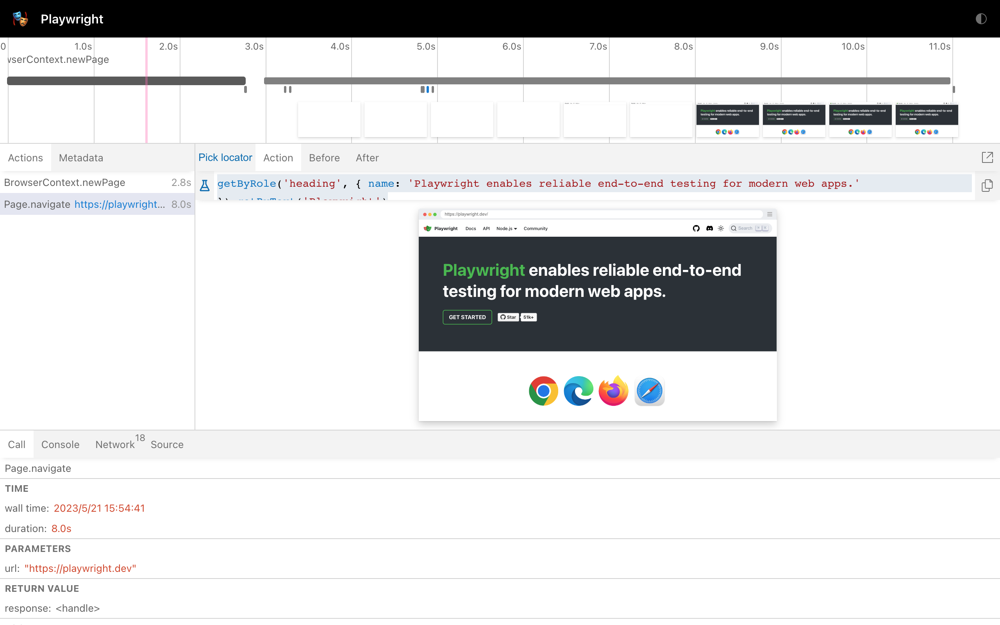

# Tracing
```text
This functionality is so awesome
It can let you see what exactly happened during your tests running
```

- setup 
```java
// in your test, configure the context to tracing
context.tracing().start(new Tracing.StartOptions()
        .setScreenshots(true)
        .setSnapshots(true)
        .setSources(true));

// before your tests over, stop the tracing and export the result
context.tracing().stop(new Tracing.StopOptions().setPath(Paths.get("trace.zip")));
```

- open and analysis tracing
```bash
# the exported zip need stay under your project directory which the pom.xml belong to
mvn exec:java -e \
-D exec.mainClass=com.microsoft.playwright.CLI 
-D exec.args="show-trace trace.zip"
```
now you can see the  Playwright Viewer, 
then you can check out what exactly happened during your tests 
